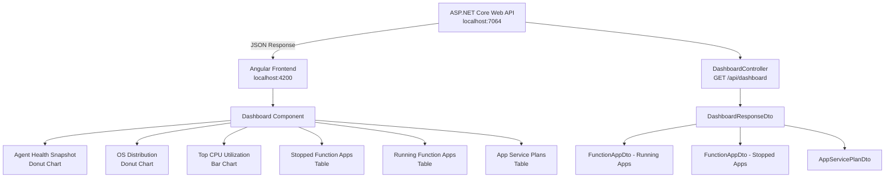

# Azure Health Monitor


Azure Health Monitor is an internal observability dashboard for tracking the health and performance of Azure Function Apps and App Service Plans. It surfaces stopped apps, resource utilization metrics, and OS distribution data through a clean Angular dashboard backed by an ASP.NET Core Web API — giving operations teams an at-a-glance view of their Azure environment.

---

## Table of Contents

- [Overview](#overview)
- [Architecture](#architecture)
- [Features](#features)
- [Project Structure](#project-structure)
- [Tech Stack](#tech-stack)
- [Getting Started](#getting-started)
  - [Prerequisites](#prerequisites)
  - [Backend Setup](#backend-setup)
  - [Frontend Setup](#frontend-setup)
- [API Reference](#api-reference)
- [Configuration](#configuration)
- [Running Tests](#running-tests)
- [Building for Production](#building-for-production)
- [Security](#security)

---

## Overview

Azure Health Monitor queries App Service Plan and Function App telemetry and presents it in a unified dashboard. Engineers can immediately identify stopped Function Apps, spot resource plans under high CPU or memory pressure, and understand the OS distribution of their infrastructure — all without leaving the browser.

---

## Architecture



---

## Features

| Feature | Description |
|---|---|
| **Agent Health Snapshot** | Doughnut chart showing total healthy vs. stopped Function Apps at a glance |
| **OS Distribution** | Doughnut chart breaking down App Service Plans by operating system |
| **Top CPU Utilization** | Bar chart of the 5 busiest App Service Plans ranked by CPU percentage |
| **Stopped Function Apps** | Table listing all stopped apps with a visual danger status badge |
| **Running Function App Details** | Table with avg. response time, memory used, health check score, region, and assigned service plan |
| **App Service Plan Details** | Full table of plans with CPU %, memory %, instance count, app count, tier, and size |
| **Azure-Themed UI** | Custom colour scheme and layout matching Azure portal design language |
| **Single API Call** | All dashboard data is fetched in one request and distributed across all components |

---

## Project Structure

```
Azure HealthMetrics/
├── .github/
│   └── workflows/                         # CI/CD pipeline definitions (GitHub Actions)
├── API/
│   └── AzureHealth/
│       ├── AzureHealth.sln                # Visual Studio solution file
│       └── AzureHealth/                   # ASP.NET Core Web API project
│           ├── Controllers/
│           │   └── DashboardController.cs  # GET /api/dashboard endpoint
│           ├── Models/
│           │   ├── AppServicePlanDto.cs    # App Service Plan data contract
│           │   ├── DashboardResponseDto.cs # Top-level API response wrapper
│           │   └── FunctionAppDto.cs       # Function App data contract
│           ├── Program.cs                  # App bootstrap, CORS, Swagger config
│           ├── appsettings.json
│           └── AzureHealth.csproj
└── UI/
    └── AzureHealthMonitor/                # Angular 19 standalone application
        ├── src/
        │   ├── app/
        │   │   ├── core/
        │   │   │   ├── models/
        │   │   │   │   ├── app-service-plan.model.ts
        │   │   │   │   ├── dashboard.model.ts
        │   │   │   │   └── function-app.model.ts
        │   │   │   └── services/
        │   │   │       └── dashboard.service.ts   # HTTP client for the API
        │   │   ├── pages/
        │   │   │   └── dashboard/
        │   │   │       ├── dashboard.component.ts
        │   │   │       ├── dashboard.component.html
        │   │   │       └── dashboard.component.css
        │   │   ├── app.component.ts
        │   │   ├── app.config.ts
        │   │   └── app.routes.ts
        │   ├── index.html
        │   ├── main.ts
        │   └── styles.css
        ├── angular.json
        ├── package.json
        └── tsconfig.json
```

---

## Tech Stack

### Backend

| Package | Version | Purpose |
|---|---|---|
| ASP.NET Core Web API | .NET 8 | REST API framework |
| Swashbuckle (Swagger) | 6.6.2 | API documentation & interactive UI |
| Entity Framework Core | 8.0.21 | ORM (ready for future persistence layer) |

### Frontend

| Package | Version | Purpose |
|---|---|---|
| Angular | 19.x | SPA framework (standalone components) |
| ngx-charts (swimlane) | 23.x | Pie, doughnut, and bar chart components |
| Angular CDK | 19.x | Layout and accessibility primitives |
| TypeScript | 5.7.x | Static typing |
| RxJS | 7.8.x | Reactive data streams |

---

## Getting Started

### Prerequisites

- [.NET 8 SDK](https://dotnet.microsoft.com/download/dotnet/8.0)
- [Node.js](https://nodejs.org/) v18+ and npm
- [Angular CLI](https://angular.io/cli) v19: `npm install -g @angular/cli`

---

### Backend Setup

```bash
cd "Azure HealthMetrics/API/AzureHealth/AzureHealth"

# Run the API
dotnet run
```

The API starts at `https://localhost:7064`.  
Swagger UI is available at `https://localhost:7064/swagger` when running in Development mode.

---

### Frontend Setup

```bash
cd "Azure HealthMetrics/UI/AzureHealthMonitor"

# Install dependencies
npm install

# Start the development server
npm start
```

Navigate to `http://localhost:4200`. The app will automatically reload on any file changes.

---

## API Reference

### Dashboard

| Method | Endpoint | Description |
|---|---|---|
| `GET` | `/api/dashboard` | Returns running Function Apps, stopped Function Apps, and all App Service Plans |

### Response Schema

```json
{
  "functionApps": [
    {
      "name": "string",
      "resourceGroup": "string",
      "region": "string",
      "serverFarmId": "string",
      "status": "Running",
      "avgResponseTime": 10.9,
      "memoryUsed": "584 MiB",
      "healthCheck": 100
    }
  ],
  "stoppedApps": [
    {
      "name": "string",
      "status": "Stopped"
    }
  ],
  "appServicePlans": [
    {
      "name": "string",
      "resourceGroup": "string",
      "region": "string",
      "operatingSystem": "windows",
      "planTier": "isolatedv2",
      "planSize": "i2v2",
      "cpuUtilization": 10.81,
      "memoryPercent": 44.8,
      "instances": 9,
      "appCount": 11
    }
  ]
}
```

Full interactive docs: `https://localhost:7064/swagger`

---

## Configuration

### Backend — CORS

CORS is configured in `Program.cs` to allow any `localhost` origin during development. For production, restrict to your deployed frontend URL:

```csharp
policy.WithOrigins("https://your-production-frontend.com")
      .AllowAnyHeader()
      .AllowAnyMethod();
```

### Frontend — API Base URL

The API base URL is defined in `src/app/core/services/dashboard.service.ts`:

```typescript
private apiUrl = 'https://localhost:7064/api/dashboard';
```

Update this to your deployed API URL before building for production.

---

## Running Tests

**Frontend:**

```bash
cd "Azure HealthMetrics/UI/AzureHealthMonitor"
npm test
```

Uses Karma + Jasmine. A Chrome browser window will open with live test results and coverage reports.

**Backend:**  
No test project is currently configured. To add one:

```bash
cd "Azure HealthMetrics/API/AzureHealth"
dotnet new xunit -n AzureHealth.Tests
dotnet sln add AzureHealth.Tests/AzureHealth.Tests.csproj
```

---

## Building for Production

**Frontend:**

```bash
cd "Azure HealthMetrics/UI/AzureHealthMonitor"
ng build
```

Output is placed in `dist/azure-health-monitor/`. AOT compilation, minification, and tree-shaking are enabled by default.

**Backend:**

```bash
cd "Azure HealthMetrics/API/AzureHealth/AzureHealth"
dotnet publish -c Release -o ./publish
```

---

## Security

- CORS is scoped to `localhost` for development — restrict to explicit origins before deploying to production
- No secrets are hardcoded; extend `appsettings.json` with Azure Key Vault references for any credentials needed
- The API currently serves **mock data** — when connecting to live Azure resources, use `DefaultAzureCredential` from the [Azure Identity SDK](https://learn.microsoft.com/en-us/dotnet/api/overview/azure/identity-readme) to avoid storing credentials in config files
- Swagger UI is only enabled in the Development environment to prevent exposing API metadata in production
- Entity Framework Core is included for a future persistence layer — apply parameterised queries and migrations before wiring up any database

---

> **Roadmap Note:** The backend currently returns hardcoded mock data. To make the dashboard live, replace the controller logic with calls to the [Azure SDK for .NET](https://learn.microsoft.com/en-us/dotnet/azure/sdk/azure-sdk-for-dotnet) or the [Azure Monitor REST API](https://learn.microsoft.com/en-us/rest/api/monitor/). The `.github/workflows/` directory is in place and ready for GitHub Actions CI/CD pipeline files.

---

*Azure Health Monitor — Internal Azure Observability Dashboard | Internal Use Only*
